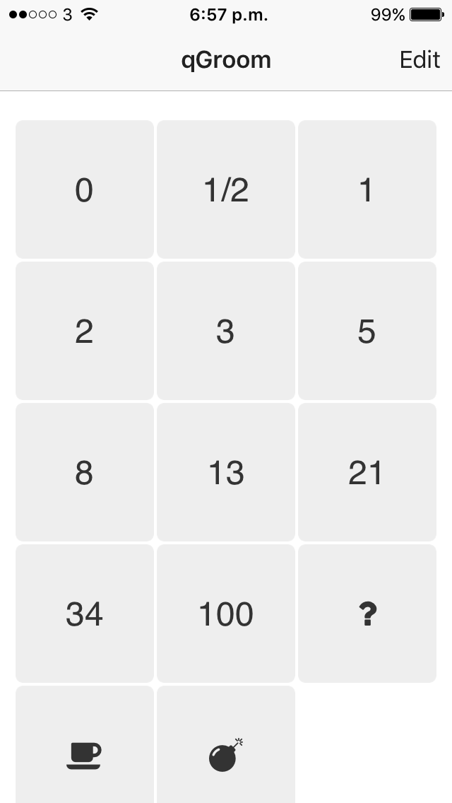
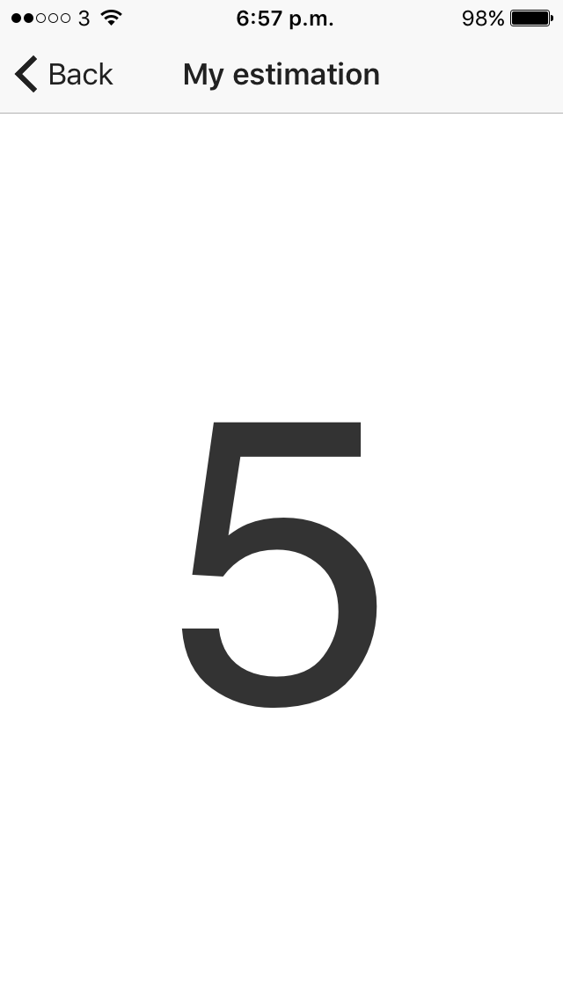
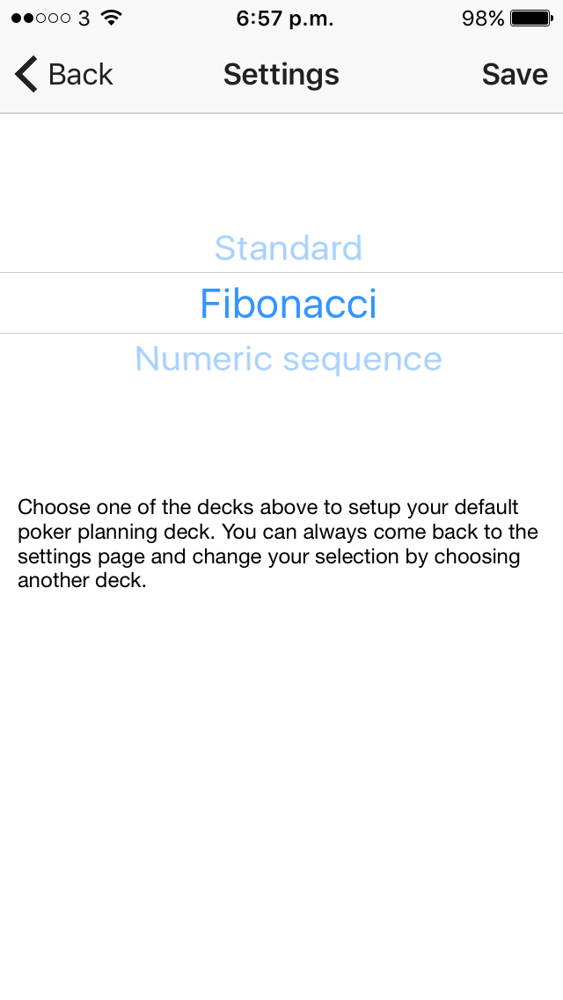
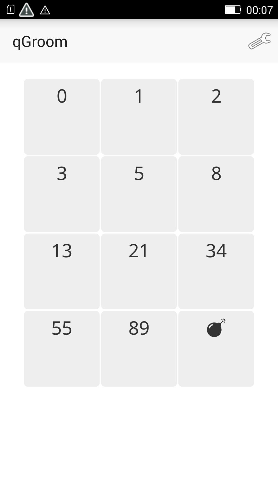
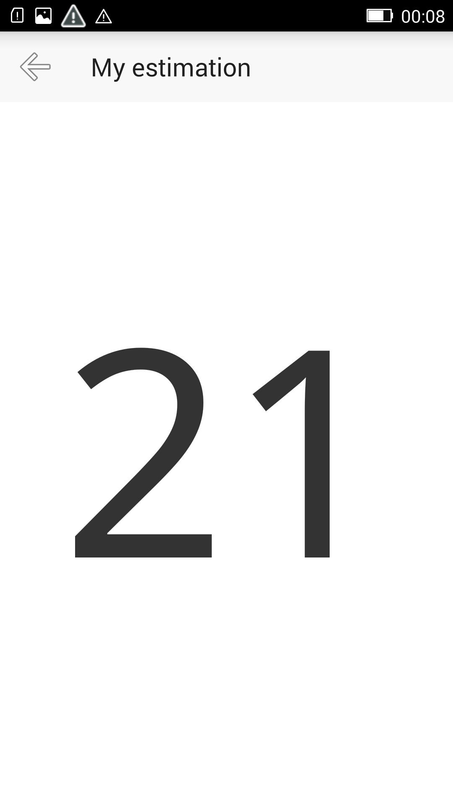
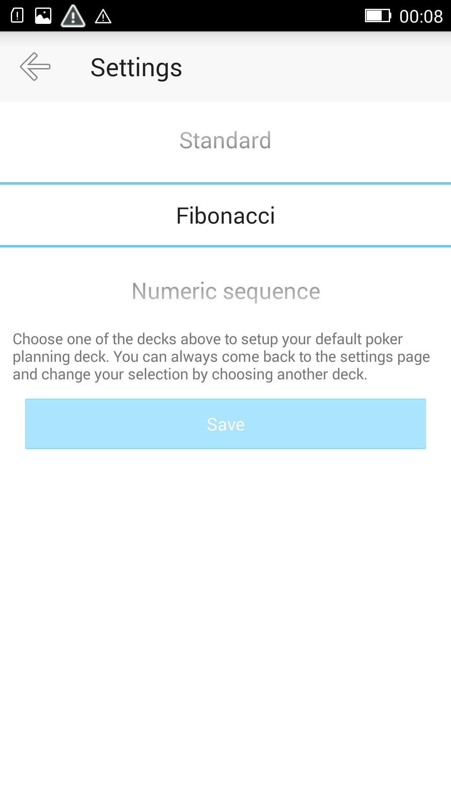

# qGroom :zap:

A simple mobile application, build with NativeScript + Angular (:heart:), to use while poker planning :coffee:.

### Supports 
1. Standard playing cards (:spades:, :crown:)
2. Fibonacci
3. Other numerical sequence (0, ½, 1, 2, 3, 5, 8, 13, 21, 34, 100, :bomb:, :question:, :coffee:)

### How it works
Just select your planning style. You are ready, just pick your estimation during your grooming session!

### Screens
#### iOS
| Deck  | Card  | Settings  |
|---|---|---|
|    |    |    |

#### Android
| Deck  | Card  | Settings  |
|---|---|---|
|    |    |    |

### License
Apache License 2.0

### Acknowledgments
Application icons made by <a href="http://www.freepik.com" title="Freepik">Freepik</a> from <a href="https://www.flaticon.com/" title="Flaticon">www.flaticon.com</a> is licensed by <a href="http://creativecommons.org/licenses/by/3.0/" title="Creative Commons BY 3.0" target="_blank">CC 3.0 BY</a>